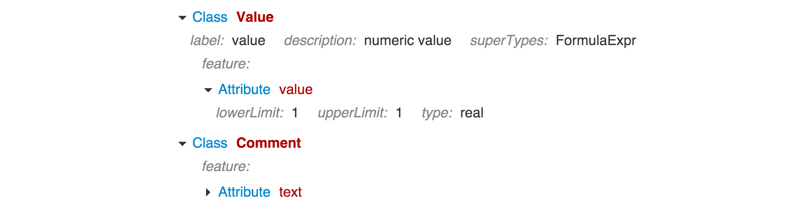
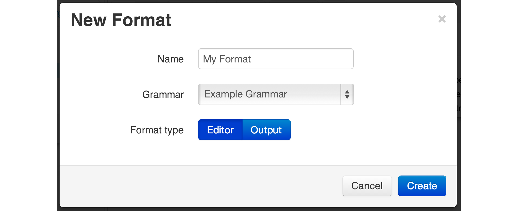
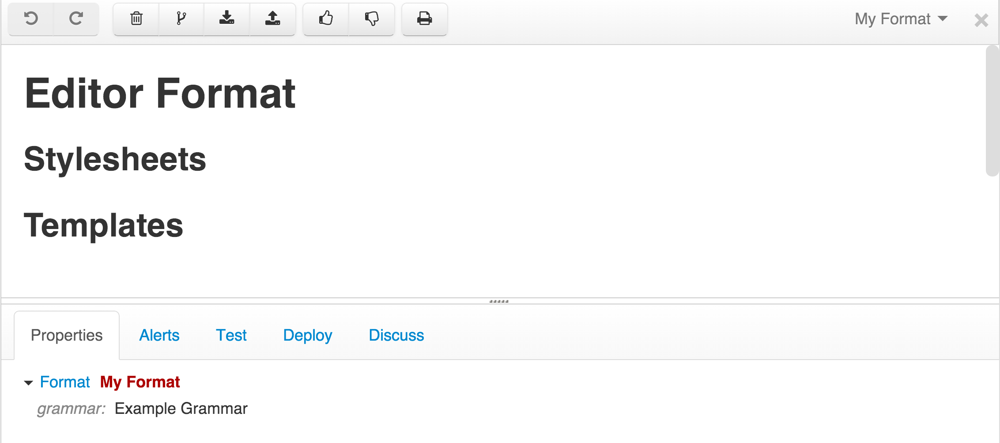

# Editor Format

By defining an editor format you can tell Grasp what an editor for your grammar should look like.

If you don't have one, Grasp will automatically generate a default outliner-style editor format for your model when you open it. An outliner is a special type of structured editor that represents elements as nested collapsible sections with attributes inside. Actually, a good example of it is a default format of an editor for the grammar itself:

It automatically highlights class and attribute names and hides optional attributes, unless user has put some values in them.

The default editor is a good choice for many situations, and you can further enhance it with class and feature labels in the grammar itself but often you will want to make your editor look differently, e.g.:

* Change the styling.
* Arrange element attributes in a form-like panel.
* Create a custom view that hides some elements or attributes - e.g. a summary view, or a requiements-only view that does not display elements that contain implementation of the requirements.

Editor formats are a great way to build custom-tailored representations of the model for different user roles, without the need to break the model into separate pieces.

## Creating Editor Format

In order to create your own format, you click on the ⊕ button in the workbench explorer and select 'Format' from the dropdown.

A dialog panel will open asking for the name of the format and its type - choose 'Editor format'. Also pick the grammar for which the format is being created:

After that a new format model will be created and you can start edititng it:

Don't worry that the only thing you see is section headers. Just click on the document and start editing as will be described in the next section.
