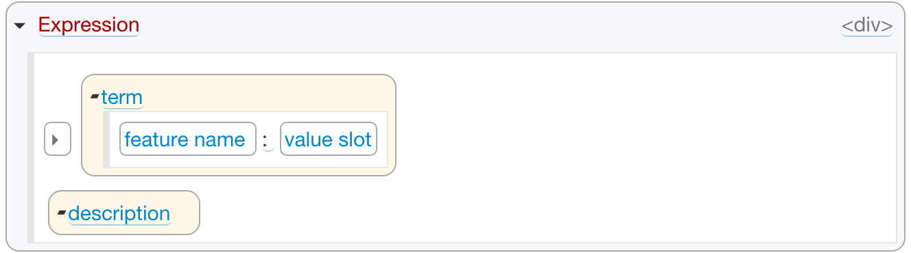

# Editor

The editor has two main sections:

* *Stylesheets* is a place you can define your own CSS styles.
* *Templates* is a place where you define editor formatting templates for classes in your grammar.

## Stylesheets

In the 'Stylesheets' section you can add either your own CSS stylesheets, using `Stylesheet` class, or URL references to existing stylesheets, using `StylesheetRef` class.

Both of them have one optional attribute `media`:`string` which is used to specify media query or media type to which this stylesheet applies to.

The difference is that in the `Stylesheet` element you get a text area to type in or paste the stylesheet itself, whereas in `StylesheetRef` you point to the URL of an existing stylesheet instead.

## Editor Templates

Editor template defines how to render model elements for some class in your grammar.

If you do not specifiy template for some class, a default outliner template will be automatically generated by Grasp at runtime.

You can add new template elements in the 'Templates' section. Here is how the template element looks like:

This element has the following attributes:

* `Class`: `Class` references, required list - grammar classes for which this template must be used.
* `HTML tag`: 'div' or 'span', required - which HTML tag to wrap the editor section into.
* `CSS class`: `string`, optional - CSS class in your stylesheet to use, if any
* `style`: `string`, optional - CSS style to inject into the generated HTML element.
* `template`: `HTML`, required - the layout of the template itself.

