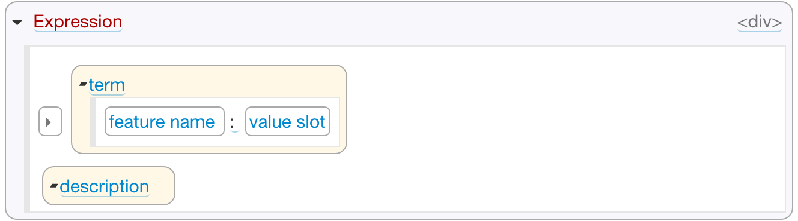

# Structured Template Format

With the structured template editor you can define your template from building blocks such as features, fold buttons, text and so on, for example:

The main benefit is that, unlike with the HTML template described later, you do not need to remember HTML tags and CSS classes specific to Grasp. Behind the scenes it generates the same markup as what you write by hand in the HTML template.

## Template Structure
The template is constructed from nested building blocks:

* Top-level level blocks such as element's class name, fold button, text and individual feature templates.
* Blocks inside the feature template, such as feature name and placeholder for feature values (value slot).

## Building Blocks

### Top-Level Blocks

The top-level blocks that you can add to the template are:

* Class name - name of the class from which this model element was created.
* Feature - a feature (attribute or reference) declared in its class. It in turn can have nested feature-level blocks descriped below.
* Fold button - &#x25B8; button that expands or collapses the element, hiding empty optional attributes.
* HTML - HTML content in WYSIWYG editor.
* Text - text or HTML in a regular text editor.

In the feature block you need to at least select the name of the class feature for which this block is added. You can also select HTML tag, add CSS classes and styles, and specify when this feature needs to be displayed:

* Always show (even if the attribute is optional and has no value yet);
* Hide when collapsed (i.e. when the fold button is closed);
* Never show (may be useful to hide some attributes that the user cannot change).

### Feature-Level Blocks

These blocks can be added inside the feature block. They are optional; if you don't add anything, the template will simply show the value(s) in that feature.

* Feature name - the name of this class feature. You can either let the editor auto-populate it from the grammar, or enter your own custom name inside the feature name block.
* Value slot - placeholder where the feature values will be placed. The value slot can in turn have another element - delimiter that should be inserted in between the values when the feature can have more than one of them.
* HTML - HTML content in a WYSIWIG editor.
* Text - text or HTML content in a text editor.
