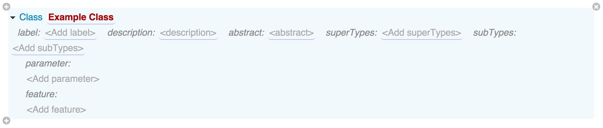

# Classes

Classes are the main building blocks of a grammar and are used to define complex data structures or language phrases.

For example, when creating a domain-specific language (DSL), you will need to define at least one class per production rule of your language's syntax. When defining a schema for a database, each class can represent a table. For configuration files it is a section, and so on.

Classes in Grasp are not the same thing as classes in object-oriented programming. They are more like data structures.

Another way to think of them is as of hierarchical templates with placeholders for user-entered values, combined with the structure into which those values are organized.

Classes are used for generating editors and output such as code or configuration files, so one of their purposes is to restrict user choices and show only what is relevant in the particular part of the edited document.

## Class Features
Just like any other model element, each class in a grammar is automatically assigned a unique GUID. It serves as a type for elements created from this class and is stored in their `_class` attribute.

Class elements also have a type: `g_Class`, where `g` is the GUID of the system grammar (a mother of all grammars) and `Class` is the id of the 'Class' element in it.

`Class` type is derived from the abstract `Classifier` type which is also a supertype for all primitive data types.

Classes can have the following features:

* `name` (string, required) - internal name of the class.
* `label` (string, optional) - even more user-friendly name that will be shown in all places where this class is used. Normally you would want to specify just the class name to avoid confusion, but there are situations where label is helpful too.
* `description` (rich text, optional) - description of the class in rich text format, which will be shown in popovers for elements of that class. Use it for documenting its purpose and to help users.
* `abstract` (boolean, optional, default is false) - marks this class as abstract only, which means you can't create elements from it, but you can use it as a superclass for other classes.
* `superTypes` (list of `Class` references, optional) - classes that this class derives its properties from.
* `subTypes` (list of `Class` references, optional) - classes to which this class injects itself as a superclass (yes, that's right - you'll learn about it a bit later).
* `feature` (list of `Feature` elements, optional) - list of attributes and references that elements of this class can contain, together with their configuration.
* `parameter` (list of `Feature` elements, optional) - list of context parameters that can be passed in as arguments from the containing element, or vice versa, set in this element in order to be propagated to its children.
If some of these features do not make much sense to you yet, don't worry. Unless you try implementing a sophisticated grammar, you may never use them, and in any case they are described in more detail in the next sections.

## Class Hierarchy

In order to be truly useful, classes are usually form a hierarchy of inheritance. This is because often there is a variety of alternative class forms for user to choose from, so we need to give them a choice of the right form first and then a way to populate features that are relevant for that form.

### Supertypes

Imagine that you need to build a grammar for an expression editor, which has constructs like `a + b`, `a - b` and so on. One way of doing that would be to create a class that has the operator (`+`, `-`) as an extra attribute, but it won't work for other types of primitives, such as unar expressions or function calls.

So a better way might be to define an abstract class 'Expression' and then several subclasses ('Plus', 'Minus' and so on) that all have 'Expression' on their `superTypes` list. Each class name by itself symbolizes the type of expression that it represents, and the editor/output format templates for that class will reflect that by showing the correct operator as a static part of the template.

Once you have such class hierarcy in place, all you need to do in the place where expression needs to be added is to add a feature of the abstract type 'Expression', and Grasp will automatically give user a list to choose one of concrete subclasses of that class. Not only that, but the list of features of the element created from the selected class will contain all features of that class, as well as all features of its superclasses.

Grasp supports multiple inheritance, meaning that a class can have several classes as its superTypes. This is convenient for creating *mixins* - abstract classes that exist only to define some feature that can then be added to any number of other classes so that they also have it. `isNamed`, `isLabeled` and similar standard classes are examples of mixins.

### Subtypes

In addition to classic inheritance, being a template engine, Grasp also supports a more exotic capability - injecting class as a supertype for other classes by using its `subTypes` feature.

In a world of object-oriented programming this approach is not used much because it violates the rules of class inheritance and encapsulation.

However, Grasp is not a programming language. It is a templating engine that is built with a different purpose in mind: to give users what they need in the editor and to maximize reuse of existing grammars. Sometimes you need to inject your class on top of somebody else's class hierarchy so that you can reuse prebuilt grammars and make your own grammar *mashups*.

For example, let's say somebody has already defined a grammar for a rule expression editor, while somebody else devloped a formula editor, and now you want to combine them to give your users an ability to use either of them when authoring their document. All you need to do in such case is define your own class and list both the formula editor and the expression editor as its subtypes.

> Note: there are other ways of achieving the same effect in Grasp, although in less elegant way: e.g. by specifying external classes as features of your own 'envelope' class.
