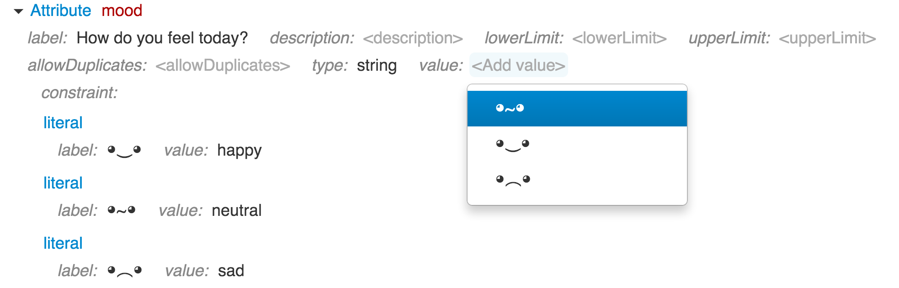

# Constraints

By using only just the types and classes in your grammar you can already achieve a lot. However, there are situations when it is not enough, for example in the following cases:

* Restricting allowed attribute values, e.g. to give a list of choices.
* Restricting allowed references by using scoping rules, e.g. to reference only the elements defined in a specific model.
* Changing display presentation of allowed values, adding user-friendly descriptions, etc.

This is what constraints help to achieve.
Constraints are declarative rules that restrict range of allowed data/reference values to a subset and, in some cases, describe how those values should be presented in the Grasp editor.

They can be defined either at the data type level, in which case they apply to all values created from such data type, or at the class feature level, in which case they will apply only to the values stored in such feature.

Here is an example of constraints that were added at the attribute level to give the user a set of options:

Attributes and references have different types of constraints that can be applied to them.

Depending on its nature, a constraint can cover either a range of allowed/disallowed values or a single value. When more than one constraint is set, at least one constraint must be met in order for the value to be valid.

When combined in a type hierarchy, constraints at the supertype level must be met before the constraints at the child type level are checked.

Constraints can be inclusive or exclusive, as controlled by their `exclude` attribute (boolean, optional, default is `false`). Normally constraint defines which values are allowed. But if `exclude` is set to `true`, it means that other values except for this specified range are allowed.

Another standard constraint attribute is `label` (string, optional), which is used to give constraint values user-friendly descriptive names.
