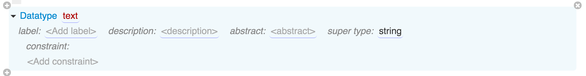

# Data Types

As we've learned in the previous section, classes are used to define structures that contain multiple properties, whereas data types represent simple values. Both can be used when defining a type of a class attribute.

Just as classes, data types form their own type hierarchy, i.e. can be derived one from another, usually with a purpose of adding *constraints* to achieve specialized editing and validation behavior.

## Standard Data Types

The most basic data types are:

* `string` - can store simple unformatted text.
* `boolean` - can store true/false.
* `real` - a numeric value.
* `integer` - a whole number.
* `date` - a date/time.
* `regexp` - a regular expression.
* `file` - a file that is stored on the Grasp server.

There are also several standard data types derived from the baic ones:

* `url`: `string` - relative or absolute URL.
* `html`: `string` - HTML-formatted rich text. A built-in rich text editor is used for editing such values.
* `text`: `string` - unformatted text that can be edited in a text area.
* `image`: `file` - an uploaded image such as an icon.

Different data types have their own visual representations and editor widgets in Grasp. For example, strings and numbers are edited in a text field but are validated differently. Values for date fields are selected from a pop-up calendar. HTML fields are edited using rich text editor or optionally as HTML markup.

## Custom Data Types

You can define your own data types by deriving them from the ones listed above. The main reason for doing that is to restrict the values that can be placed into attributes of such types. This is done by adding constraints, which are described in the next section.

For example, with proper constraints you can transform a simple text field into a dropdown list that shows only the values allowed for this attribute.

Data type elements can have the following features:

* `name`: `string`, required
* `label`: `string`, optional
* `description`: `HTML`, optional
* `abstract`: `boolean`, optional, default is `false`
* `superType`: `Datatype` references, optional list
* `constraint`: `Constraint` elements, optional list

They have the same meaning as in other Grasp grammar elements, e.g. [class features](Features.md).

When custom data type uses other data types as supertypes, all of their inheritance chains must lead to the same basic root type - e.g. a string or an integer, but not both.
