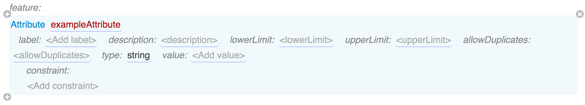
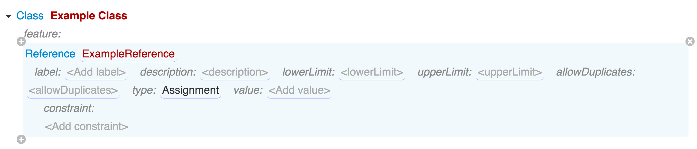

# Class Features

Features provide means to attach user-entered (or user-selected) information to elements created from the class. `Feature` is an abstract class in the system grammar that has two concrete subclasses:

* `Attribute` represents simple and complex values stored by value. I.e. when a new attribute is added to an element, be it a primitive value or an instance of a class, its content is stored right there in the element.
* `Reference` represents a reference to an element defined in some other place - in the same or other model. References can only point to complex elements, not primitive values.

Attributes are used to put together the content of your model, to define new informational entities in it. References are used to avoid duplication. For example, you can define an element of class "Variable" in one place, and then put references to that variable in all expression elements that use it.

When you add new feature to a class, Grasp will ask you to select its type first - Attribute or Reference. Then you will need to populate its own properties, which are describd below.

## Attributes

An attribute can have the following features:

* `name` (string, required) - name of the attribute as it will be stored in the model's JSON document.
* `label` (string, optional) - user-friendly name that will be shown in the model editor.
* `description` (rich text, optional) - description that will be shown in the popup with attribute's documentation in the model editor.
* `lowerLimit` and `upperLimit` (integer, optional) - define how many values this attribute can hold. Useful combinations:
    * `[0; 1]` or simply no values makes this attribute optional.
    * `[1; 1]` makes it required.
    * `[0; -1]` makes it an optional list that can hold 0 or more values (-1 means 'unbounded').
    * `[1; -1]` makes it a list with at least one value.
    * Other combinations of lower and upper limit can be used to define the exact count of values that the list can hold.
* `allowDuplicates` (boolean, optional, default is `true`) - controls whether the same exact value can occur twice in the attribute's value list.
* `type` (reference to an element of type Classifier, required) - class or data type of this attribute, which controls the kind of values this attribute can contain.
* `value` (type is dynamically controlled by the type attribute, optional) - default value to be used for this attribute when elements of the class a created.
* `Constraint` (optional list of `Constraint` elements) - editor/validation constraints that will be used to control the values that can be stored in this attribute. Constraints are discussed later in this guide.

To repeat, attribute's type can be either primitive value that has a *data type*, which is explained later, or a complex value, i.e. an instance of a *Class*, in which case it can contain its own features.

It's also worth here to bring attention to the dynamic nature of the `value` attribute - its type and validation logic change automatically based on what was selected in the `type` attribute for the same class. This is a first example of a *context-aware grammar*, where user's choices in one part of a model have immediate effect on other, related parts. Such dynamic nature is what makes Grasp a powerful tool in modeling complex semantic information structures.

## References

`Reference` type is derived from the same abstract `Feature` superclass as the `Attribute` and has the same features:

The only difference is that, unlike `Attribute`, you cannot use it to create new element instances. It can only point to existing elements of the specified `type` (or its subtypes), created elsewhere.

The value of a reference is the GUID of the referenced element, which is dynamically substituted by its label or name when shown in the editor.

Thanks to that, you can rename Grasp elements at any time without risk of breaking references that point at them.
