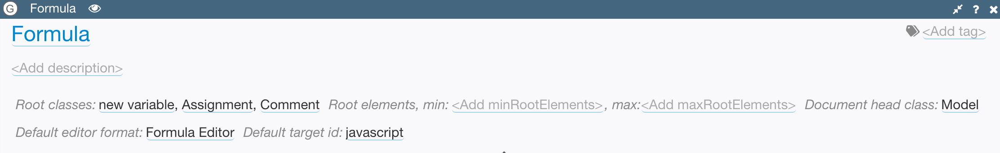

# Basic Structure

Grammars can have the following elements in them:

* Classes describe complex structures that can contain features.
* Data types describe primitive types used as simple attribute values, such as strings or numbers.
* Sections are used to group related elements together. For example, you can have one section for classes and another one for data types.
* Comments are used to document the meaning of other elements and to provide rich formatting that you can use if you want to make your grammar look like a real document.

You can create any number of these elements at the top level. You can also add them inside sections.

Grammar uses customized head element which has important fields to help Grasp understand how models must be created from it:

* `Root classes` - zero or more classes declared in this grammar that can be used in the root of a model. If no classes are added to this list, then the grammar is considered *abstract*, i.e. users won't be able to create models directly from it, but its content can be used by other grammars.
* `Head class` - class to be used as a head class for models created from this grammar. You can leave the default value or create your own subclass of the Model class and add your own attributes to it.
* `Min` and `max` `root elements` specify how many top-level elements can be created in the models created from this grammar.
    * If `min` >= 1 then the root classes will be instantiated added to the model in the order they are specified in the grammar until their minimum count is reached.
    * `max` = -1 means there is no restriction on the maximum number of elements.
* `Default target id` specifies the output format that must be used for code generation by default when testing or deploying this model.
* `Default editor format` specifies the format that must be applied by default when the model is opened for editing.
