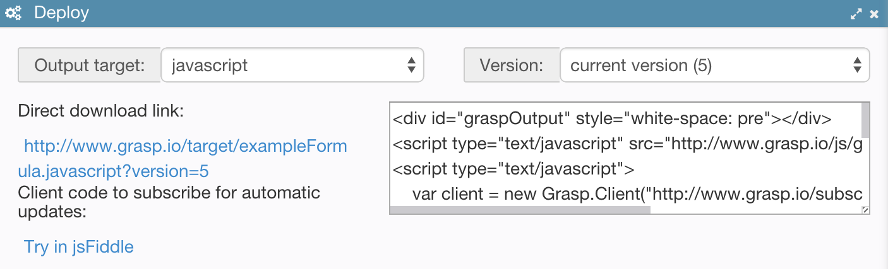

# Content Delivery

In most cases the models or output generated from them will need to be delivered to the downstream systems and applications in a format that they can understand.

In some cases it can simply be the JSON format of the models themselves. In other cases it can be target format produced by an output generator, as was described earlier.

The **Deploy** panel is a helpful resource to learn how to access this content:



You can programmatically obtain model data or generated output in a couple of ways:

* Through the REST API
* Through the subscription channel

## REST API

Getting the JSON content of the model itself is simple - just execute the following REST calL:

`GET /model/{model GUID}`

Pass the GUID of the model you are interested in. You can find it by looking at the URL shown in the browser when you open the model for editing.

Similarly, you can easily obtain the target output of the model by making the following REST call:

`GET /target/{model GUID}.{target ID}`

The `target ID` is the name of the target that was assigned in the output generator template.

This API method takes one of two optional request parameters:

* `?version={version number}` - to retrieve a specific version of the target. Without it, the latest version of the model checked into the repository will be used.
* `?workbenchRef={workbench GUID}`- to retrieve version of the target that was produced for your private copy of the model edited in the workbench. This is useful for integration testing prior to publishing model changes into the repository.

In response server will return just the generated content (no headers and other metadata) which you or your application can save and use as is.

## Subscription API

Another useful way to get target updates is to subscribe for their changes.

Grasp uses publish-subscribe framework called [Faye](http://faye.jcoglan.com/) for delivering generated content to the downstream systems. It is a JavaScript-based implementation of [Bayeux protocol](http://svn.cometd.com/trunk/bayeux/bayeux.html), which is protocol-compatible with [CometD](.

Grasp provides a client written in JavaScript that loads Faye client and subscribes for the target changes. You can implement a client in other language on top of an existing Bayeux or CometD client for that language, e.g. for Java: [Java CometD Client](http://docs.cometd.org/reference/java.html).

The JavaScript-based subscription client provided by Grasp can be added to your application as shown by an example provided on the **Publish** panel in the editor:

```html
<script type="text/javascript" src="http://www.grasp.io/js/grasp/grasp-client.js"></script>
<script type="text/javascript">
    //Create a client
    var client = new Grasp.Client("http://www.grasp.io/subscribe");

    //Configure subscription parameters
    var channel = {model: "j3vMecmnKv", target: "java", version: "5"};

    //Subscribe and process target changes in a callback function
    var subscription = client.subscribe(channel, function(target) {
        //target.body contains generated content
    });
</script>
```

Upon subscribing the client will immediately get an update with the current version of the target. Then whenever it changes, another update will be sent.

If the client gets disconnected because of network connection problem, it will automatically reconnect and receive updates as soon as connectivity gets restored.

Grasp client takes the following configuration parameters:

| Name        | Type   |  Description |
| ---------------- |---------------|-------------|
| `model` | Model GUID, optional | Model for which target is generated. If missing, all updates in the repository will be delivered, provided that they match other subscription criteria |
| `target`| string, optional | Target ID. Can only be set if the model ID is provided. If missing, all target updates for the specified model will be delivered, provided that they match other subscription criteria |
| `version` | string, optional | Specific version to load |
| `workbench` | Workbench GUID, optional | Load version that is currently being edited in a specific workbench. If not set, version from the master repository will be provided. |

If you write your own client, you need to open a server connection with the Grasp server at its `/subscribe` HTTP endpoint using Bayeux protocol with the following **channel** format:

`/target[/workbench({workbench GUID}) -OR- /repository({repository GUID})[/model({model GUID})[/target({target ID})[/version({version ID)]]][/**]`

To make it simpler, the subscription channel is a `/`-separated path with the following restrictions:

* It starts with `/target`.
* After that you need to provide a repository or a workbench GUID by adding eiter `/repository({repository GUID})` or `/workbench({workbench GUID})`.
* After that you can optionally specify GUID of the model by adding `/model({model GUID})` to the path.
* If model GUID is provided, you can optionally specify target by adding `/target({target ID})` to the path.
* If target ID is provided, you can optionally specify version of the model by adding `/version({version ID})` to the path.
* Finish by adding `/**` to the path.

Here is an example:

`/target/workbench(1DXQKgqaSz)/model(j3vMecmnKv)/target(java)/**`

Messages pushed through the subscription channel are JSON documents that have the following format:

```javascript
{
  "head" : {/*<head element>*/},
  "body" : "JSON-encoded generated content",
  "target" : "<target ID>"
  /*<other model-related fields>*/
}
```
Essentially it is the same as the JSON document for the model from which this target has beeen generated, only the "body" attribute contains generated target content instead of model definition, and there is a "target" attribute that indicates what type of a target this is.


