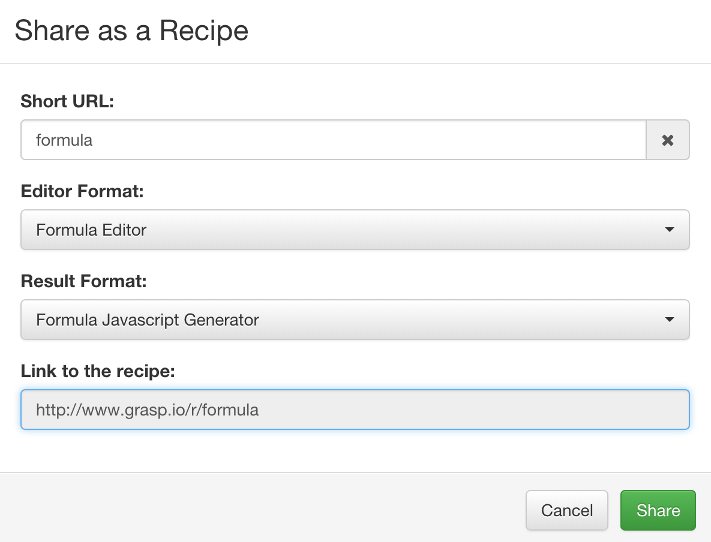

# Editor Recipe

Recipe is a convenient way to publish a structured editor for a popular document format without sharing your entire Grasp repository with users.

It is a web page that shows only two views:

* Structured document editor;
* Code generation result view.

It is accessible via a custom URL that you can pick yourself to make it easy to remember.

The recipe can be produced either from a grammar or from a document already created with it, in which case such document will be used as a starting template.

Visitors can use the editor to create their own documents and save generated results to their local drive. They can save the documents on the server and share link to them with other people.

In addition, registered users can also save edited documents to their own private repository.

## Creating a Recipe

In order to create a recipe, first you need to develop a grammar, an output format and optionally an editor format. You may also want to create a model that you would like to be used as a starting point, e.g. a document example.

After publishing them to the Grasp repository you can open either the grammar or the model and run 'Share > Share as a recipe' from its toolbar.

It will open a dialog where you can configure your recipe:

* Short URL - an easy to recognize relative URL that you want to use for this recipe.
* Editor Format - which editor format to use by default.
* Result Format - which output format to use by default.
* Link to the recipe - a read-only field with auto-generated URL where the recipe will be published at.

After you click on "Share", the recipe will be immediately published at the specified URL.

At any time you can open this dialog again and click on "Unshare" to remove it. Please keep in mind that this will remove all content created by users with it.
