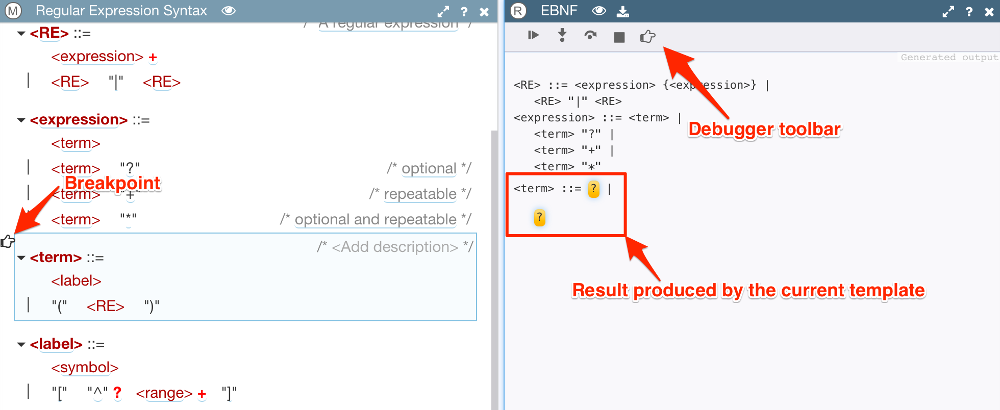
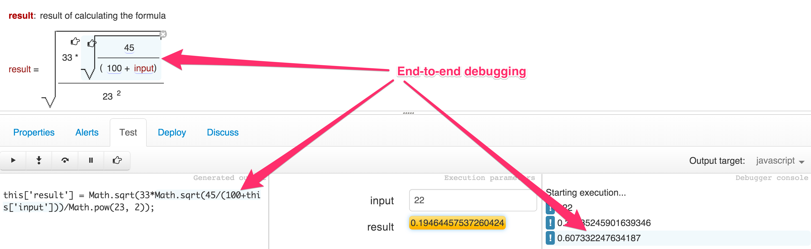

# Debugger

You've probably briefly learned about the debugger from the Users Guide in the section that described the **Test** panel.

As a reminder, the test panel is shown below the editing area and it provides ability to generate model's output using one the the formats available for its grammar. With it you can add breakpoints to the model and/or run generator in step-by-step mode.

Once the output is generated, you can click on any place in it, and the corresponding model's element that was a source of it will be automatically selected and highlighted. And vice versa, you can select any element in the model and it will highlight the output generated from this element.

## Output Debugger

The main functionality provided by the test panel is to let you debug the output generation logic.

Here is an example of what the editor with the output debugger open looks like:



And here is one possible sequence actions that led to this state:

1. A breakpoint was set by selecting model's element and clicking on the 'Add/remove breakpoint' button in debugger's toolbar (the one with hand, on the right side) .
2. Desired output format ('javascript') was selected from the dropdown on the right of the test panel.
3. Output generation was triggered by clicking on the 'Run' button in debugger's toolbar (the one with triangle on the left side).
4. Generation began, produced some output and stopped at the breakpoint.

As you can see from the screenshot, the output from the elements that have not been visited yet is shown with yellow placeholders. As you step into the model by clicking on the second button from the left you will see how those placeholders get replaced with generated text and new placeholders appear inside of it, until all generation is done. This is very helpful in understanding why given model and format have produced an output that you see on the screen.

Instead of setting a breakpoint and clicking on 'Run' button, you can start generation by clicking on the 'Step into' button. This is equivalent to setting a breakpoint on the very first top-level element in the model.

## JavaScript Debugger

> Status: **Experimental**

If the target of your output format is 'javascript', then you can try out another cool feature of Grasp: ability to run generated Javascript code in a debug mode and track the results produced by it all the way back to the model from which the code has been generated.

To do so, run the code generator until it is finished and you see the following text on the console:

```
Generation complete
```

Now click on the 'Run' button once again. The second debugger, this time for the generated code itself, starts and it will stop at the same breakpoints as before. You can also step into the code if you want to.

The result generated by each step is printed to the console. Now you can click on any place in the model, in the generated text or in the console, and Grap will automatically select and highlight corresponding parts in other panel to give you a complete picture of what is going on with your model:



> As this is still an experimental feature (more like demonstration), not all JavaScript code generated by your models can be debugged. This should improve in the future.
