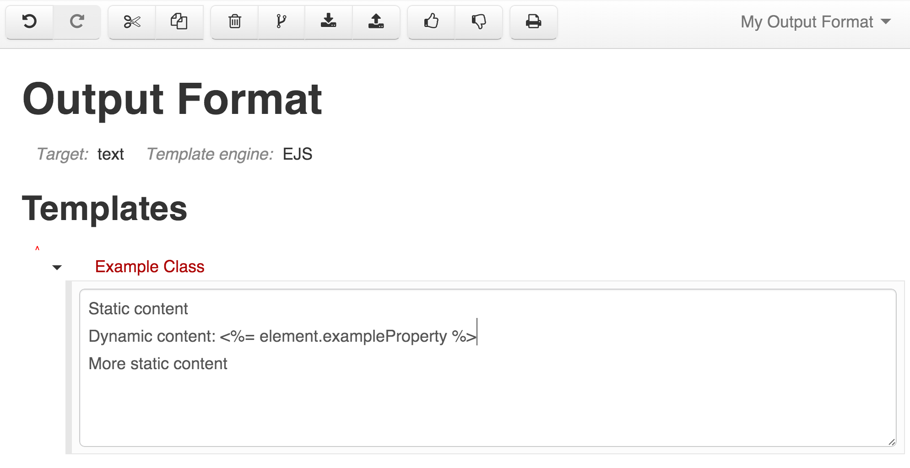

# EJS Template Format

EJS templates used for output generation usually consist of static text with dynamic values injected into it by special tags that contain JavaScript expressions. Here is an example:

The list of tags is very simple:

| Tag        | Description   |
| ---------------- |---------------|
| `<%= expression %>` | Inserts the value produced by the `expression` after applying HTML escaping rules to it|
| `<%- expression %>` | Inserts the value produced by the `expression` as is, without escaping it |
| `<% expression %>`    | Executes `expression` that can contain e.g. conditional logic or generator API call |

Each template is responsible for a single element. In order to process sub-elements, you need to put into the `<% %>` tag a call to the generator's `next()` method that will activate templates for child attributes.

There are other methods that you may need to use in order to navigate and process complex models, as described in the next section.

