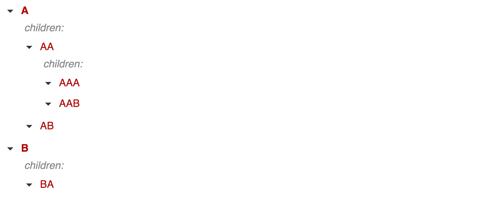
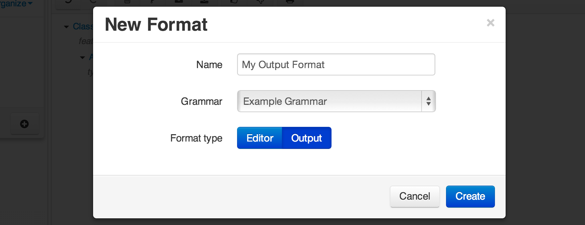
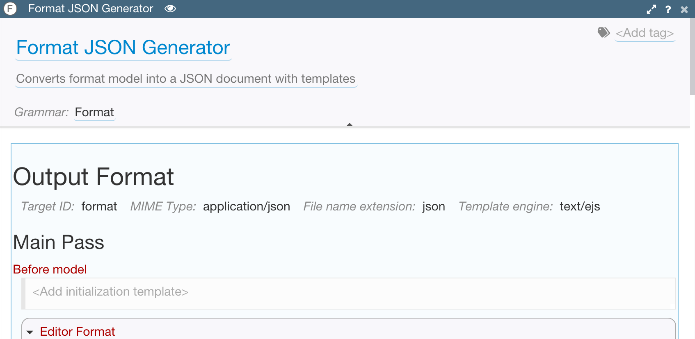

# Output Format

Editing documents that are grammar-driven is nice, but what is the purpose of creating them in the first place? Sometimes all you need is the JSON format in which the documents are stored. However, in many cases they need to be transformed into some ofther format - text or code - that is needed by the computer system that will be using this information.

For example, you may present configuration document to a user for editing in a nice form-like format, but the application that is configured by it needs an XML file or a programmatic script.

In such case you need to implement an output format template that will generate an arbitrary text from your model.

You can define multiple formats for different generated *targets*, i.e flavors of the output. For example, if you are building a code generator, you can implement formats for different languages, or different outputs in the same language, such as interface definition and logic implementation. Each target is identified by its name, and users or client applications can later specify which target they are interested in.

Generated targets are stored in special models that contain your output in the body, but can also have metadata associated with it in the header section.

## How Output Generator Works

Output format is similar in some aspects to an editor format in a sense that it is a collection of templates defined for various classes in your grammar. However, it's underlying use is different. Instead of producing HTML with certain styles, it is a text generator that performs a recursive depth-first walk of the model tree and invokes applicable output template for each element to combine some static text with element's own features.

If you ever used templating engines for generating web content, it is pretty similar to that. In fact, the output generator uses well-known Javascript-based templating engine to do its job.

When producing an output from the model, the generator starts from the top, i.e. root elements, and visits their sub-elements if the templates for the parent elements' classes request that.

For example, consider a model tree that looks like this (simplified example for clarity):

When working on it, the output generator will walk through the tree in the *depth-first* order: `A, AA, AAA, AAB, AB, B, BA`. It will produce an output from a parent element first and then will fill in blanks for child elements when visiting them.

In order to produce desired output your template will combine static text with code written in JavaScript and calling generator API methods in order to insert dynamic content or control the generator.

## Creating Output Format

You create an output format in almost the same way as the editor format. Click on the ⊕ button in the workbench explorer and select 'Format' from the dropdown.

A dialog panel will open asking for the name of the format and its type - this time choose 'Output format'. Also pick the grammar for which the format is being created:

After that a new format model will be created and you can start edititng it:

